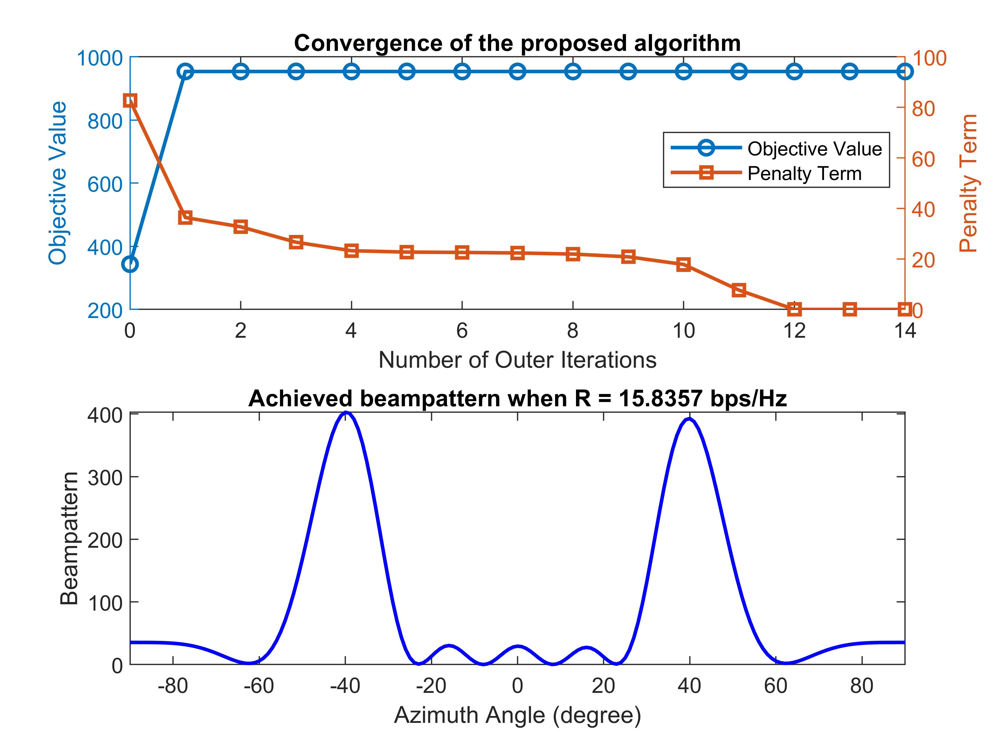

# noma-empowered-integrated-sensing-and-communication

The code for the paper 
**Z. Wang, Y. Liu, X. Mu, Z. Ding and O. A. Dobre, "NOMA Empowered Integrated Sensing and Communication," in IEEE Communications Letters, vol. 26, no. 3, pp. 677-681, March 2022, [doi: 10.1109/LCOMM.2022.3140271](https://ieeexplore.ieee.org/abstract/document/9668964).**

## Running the simulations

### Prerequisites

- [MATLAB](https://uk.mathworks.com/products/matlab.html)
- [CVX](http://cvxr.com/cvx/)

### Launch

Run `main.m`

### Expected Results

#### Convergence and Beampattern


## Citing
If you in any way use this code for research, please cite our original article listed above. The corresponding BiBTeX citations are given below:
```
@article{wang2022noma,
  title={{NOMA} empowered integrated sensing and communication},
  author={Wang, Zhaolin and Liu, Yuanwei and Mu, Xidong and Ding, Zhiguo and Dobre, Octavia A},
  journal={{IEEE} Commun. Lett.},
  volume={26},
  number={3},
  pages={677--681},
  year={2022},
  month=mar,
  publisher={IEEE}
}
```
